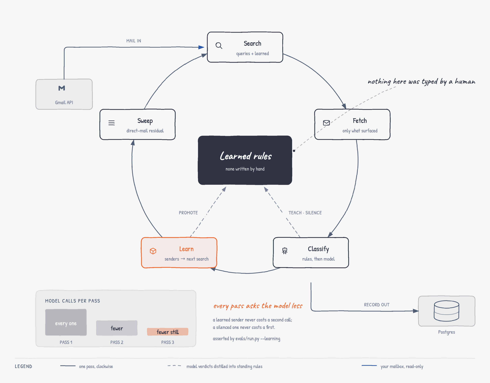

<h1 align="center">jobd</h1>

<p align="center"><b>A job-search daemon. Your search, reconstructed from your own mail.</b></p>

<p align="center">
A job search scatters itself across hundreds of Gmail threads —
applications, recruiter back-and-forth, interview invites, offers,
silence. Nobody keeps the spreadsheet, so nobody can say what the search
actually cost. jobd reads the mailbox and rebuilds the record as a
local-first CRM: companies, applications, stage timelines, offers, every
row linked to the message that evidences it. No mailbox download, no
hosted service, nothing typed in by hand.
</p>

<p align="center">
  <a href="https://jobd.demo.rsaim.dev"></a>
  <a href="https://codespaces.new/rsaim/jobd"></a>
  <a href="pyproject.toml"></a>
  <a href="LICENSE"></a>
</p>

<p align="center">
  <a href="#what-a-job-search-actually-cost-you">What it cost you</a> ·
  <a href="#how-it-works">How it works</a> ·
  <a href="#screenshots">Screenshots</a> ·
  <a href="#try-it--no-credentials">Try it</a> ·
  <a href="#what-leaves-your-machine">Privacy</a> ·
  <a href="docs/numbers.md">The numbers</a> ·
  <a href="docs/tour.md">Docs</a>
</p>

---

## What a job search actually cost you

Nobody records this while it's happening, so nobody can tell you. The mail
can: a funnel of 429 companies down to 8 offers, 150 confirmed interview
rounds, 11.2 weeks from first contact to an offer, a 26% ghost rate — and
the two numbers no spreadsheet has ever held. **~126h in interview rooms.
~437h prepping for them** — the invisible half of a job search: the
practice before a technical round, the system-design sweep before an
onsite, the standing weekly grind in any month the search was live. 437
hours that never appeared on anyone's calendar.

Every count is derived from the mail, never typed in. The hour figures are
estimates anchored on corroborated interview rounds, not measurements, and
the weights live in one editable place. How every figure is computed — and
which are measured versus assumed — is in
**[docs/numbers.md](docs/numbers.md)**.


## How it works

One command a day. `jobd scrape` runs a LangGraph search loop over the
Gmail API: a measured pack of queries, then classification in tiers —
protocol signals and learned sender rules decide most mail for free, and a
model reads only the residue the cheap tiers could not settle. Every
confident verdict distills into a standing rule, so tomorrow's pass asks
the model about less — cheaper each run, and more accurate, because a
learned sender is one the cheap tiers can no longer wrongly drop. The loop
lets every confident hit teach new senders to search, and converges when
the frontier is empty (1–2 hops).

Retrieval is measured, not hoped for: **97% of the job-related mail found
by fetching 20% of the mailbox; 100% at 29%** — scored against a fully
labeled reference mailbox, tables and ablations in
**[docs/numbers.md](docs/numbers.md)**.

<picture>
  <source media="(prefers-color-scheme: dark)" srcset="docs/img/seed-expand-loop-dark.png">
  
</picture>

*`plan` seeds the first search; `report` closes the run once the frontier is
empty. The dashed spokes are the part that compounds: model verdicts distill
into standing rules, so the next pass asks the model less.*

Here is the loop live — a one-day sync against a real mailbox. 334 Gmail
calls in 29 seconds, and every message they surface is already in the
record, so nothing is re-fetched and no model is paid: idempotency on
camera. The closing lines are the record's own totals — 8 offers, 41
rejections — straight from the dashboard's counting rules.


No hardcoded rules anywhere. A first confident extraction teaches a sender
domain `undecided`; a second one *resolving to the same company* promotes
it to a zero-cost carry path — so an agency fielding five clients never
fuses five hiring processes into one timeline. Negatives silence a sender
immediately. The loop is a testable claim, so it has a test:
`evals/run.py --learning` asserts a second pass costs fewer model calls at
no accuracy loss.

## Screenshots

Everything below is the synthetic demo corpus — a job search across the
Forbes AI 50 (2026), invented mail against real employer names, replayed
through the real pipeline — as `jobd demo` itself discloses. The sync
recording above is the one real-run capture, and it shows only aggregate
counters.

Open a company you never told it about, and the hiring process is already
reconstructed — timeline, stages, summary:


Every company page ends in a reply composer: pre-addressed from the thread,
a tone picker fed by your saved prompts, a drafted body you edit. **Sending
only ever happens on your click.**


The rules the pipeline taught itself, each with the verdict it carries and
the extraction that taught it:


And the cost accounting — how many messages the free tiers absorbed before
any model was asked:


## Try it — no credentials

The demo is **hosted**: [jobd.demo.rsaim.dev](https://jobd.demo.rsaim.dev),
log in as `demo` / `demo`. Nothing to install, nothing to sign up for.

Or run it yourself —
[](https://codespaces.new/rsaim/jobd)
— the stack builds itself, the demo loads, the dashboard opens on port 8100.
Locally:

```bash
docker compose up -d --build
docker compose exec app jobd migrate up
docker compose exec app jobd demo
# open http://localhost:8100
```

The demo needs no key: the corpus is synthetic and replays
deterministically, offline. A model (and `OPENROUTER_API_KEY`) enters the
picture only for live runs against real mail. For your own Gmail, model
choices, and the daily cron: **[docs/tour.md](docs/tour.md)**.

## What you get

* **One command a day.** `jobd scrape` backfills once, then runs as a
  three-day-window cron. Idempotent by construction: overlap costs one
  cheap listing pass, never a re-download.
* **A live dashboard** — watch a run as it happens (the pipeline drawn as a
  transit rail, per-query yields, a feed of discoveries), then browse the
  record it built: companies, offers, rejections, a review queue, search.
* **Learned-first classification** — protocol signals and learned sender
  rules decide most mail for free; a model reads only the undecided residue.
* **A reply composer on every company page** — drafted, never sent without
  your click.
* **Any model** — any LiteLLM id via OpenRouter, swapped with one
  environment variable.

## What leaves your machine

jobd ships no service and phones home to nothing — there is nowhere to
phone. What leaves your machine:

| Configuration | Leaves your machine |
|---|---|
| Live runs | Only messages that survive the metadata prefilter, inside the extraction prompt — 41% of the reference mailbox never reached a model. |
| `jobd demo` | Nothing real exists in this mode. |

The Gmail scope is `gmail.readonly` + `gmail.compose` — it can read mail and
send *your* composed reply, never label, archive, or delete
(`gmail.modify` is never requested). The OAuth client is yours
([docs/gmail-setup.md](docs/gmail-setup.md), ~10 minutes): jobd ships no
shared client id, so this project is never a data processor for your mail.
Tokens live in the OS keyring; raw mail is stored write-once and
content-addressed on your own disk. The full accounting
— every credential, every write path — is in **[SECURITY.md](SECURITY.md)**;
any discrepancy between that file and the code is a bug.

## More

* **[docs/numbers.md](docs/numbers.md)** — every headline figure: measured
  vs. assumed, and how to re-verify each
* **[docs/tour.md](docs/tour.md)** — every feature, Gmail setup, design
  invariants, layout
* **[docs/seed-and-expand.md](docs/seed-and-expand.md)** — the experiment
  series behind the retrieval numbers
* **[docs/architecture.md](docs/architecture.md)** — how the pieces fit
* **[docs/gmail-setup.md](docs/gmail-setup.md)** — create your OAuth client,
  once, in about ten minutes
* **[AGENTS.md](AGENTS.md)** — operating manual, for humans and agents

## Contributing

Issues and pull requests are welcome. [AGENTS.md](AGENTS.md) is the
operating manual — executable as written, for humans and coding agents
alike — and `jobd demo` gives every contributor a fully populated system
with no credentials. `pytest` runs the suite; `evals/run.py` re-verifies
the retrieval and learning claims. Security findings:
[SECURITY.md](SECURITY.md#5-reporting).

## License

[MIT](LICENSE) © Saim Raza
