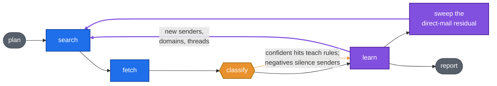

# jobd

**Finds 97% of the job-related mail in a Gmail account by fetching 20% of
it. 100% at 29%.** No mailbox download, no hardcoded sender lists — a
search loop that learns which senders to ask about next, and gets cheaper
every run. Out the other end comes a local-first job-search record:
companies, applications, stage events, every row linked to the mail that
evidences it.


## The problem, measured

Downloading the mailbox to classify it means fetching 58,331 messages to
find the 2,631 that matter — 4.5% signal. So the mailbox got labeled and
retrieval strategies got scored against it. The first surprise: the
obvious heuristic — searching `careers@` / `talent@` — has **0.2%
precision** (3,542 fetches, 7 real). What works is your own sent mail:
half of all job mail sits in a conversation you replied to.

| Strategy | Fetches | % of mailbox | Recall |
| --- | ---: | ---: | ---: |
| Full sweep (the naive baseline) | 58,331 | 100% | 100% |
| ATS + strong phrases + threads | 4,561 | 7.8% | 49.7% |
| Wide seeds + expansion | 11,076 | 19.0% | 93.5% |
| + sent-mail seeds, address-level expansion | 11,778 | 20.2% | **97.1%** |
| + triage of the direct-mail residual | 17,142 | 29.4% | **100%** |

The full experiment series — per-query ablations, the failure analysis of
the last 75 missed messages, which negative signals are traps — is in
**[docs/seed-and-expand.md](docs/seed-and-expand.md)**.

## How it works

A LangGraph state machine runs a measured pack of Gmail queries, classifies
what returns, and lets every confident hit teach new senders to search —
looping until the frontier is empty (1–2 hops), then sweeping the
direct-addressed mail nothing matched.



No hardcoded rules anywhere. A first confident extraction teaches a sender
domain `undecided`; a second one *resolving to the same company* promotes
it to a zero-cost carry path — so an agency fielding five clients never
fuses five hiring processes into one timeline. Negatives silence a sender
immediately. The loop is a testable claim, so it has a test:
`evals/run.py --learning` asserts a second pass costs fewer model calls at
no accuracy loss.

## Quickstart — one API key

```bash
export OPENROUTER_API_KEY=<your key>  # the demo's ~100 flash calls cost cents
docker compose up -d --build
docker compose exec app jobd migrate up
# JOBD_RUN_BUDGET is the hard dollar ceiling classify refuses to run without
docker compose exec -e JOBD_RUN_BUDGET=1 app jobd demo
# open http://localhost:8100
```


The demo is a synthetic job search across the Forbes AI 50 (2026) — real
employers, invented mail — through the real pipeline. For your own Gmail,
model choices, and the daily cron: **[docs/tour.md](docs/tour.md)** and
[AGENTS.md](AGENTS.md).

## Reply without leaving the record

Every company page ends in a composer: pre-addressed from the thread, a
tone picker fed by your saved prompts, a drafted body you edit. Drafts are
model-written under house style rules that keep them plain; **sending only
ever happens on your click** — the Gmail scope is `compose`, never
`modify`.


(Screenshots and the GIF are the synthetic demo corpus — invented messages
against real AI 50 employer names, as `jobd demo` discloses. The retrieval
tables are measured on the reference mailbox, which stays private.)

## More

* **[docs/tour.md](docs/tour.md)** — every feature, Gmail setup, design
  invariants, layout
* **[docs/seed-and-expand.md](docs/seed-and-expand.md)** — the experiment
  series behind the numbers
* **[docs/architecture.md](docs/architecture.md)** — how the pieces fit
* **[AGENTS.md](AGENTS.md)** — operating manual, for humans and agents
