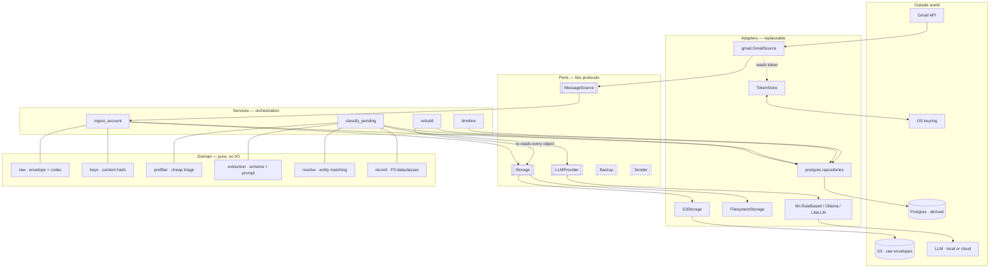
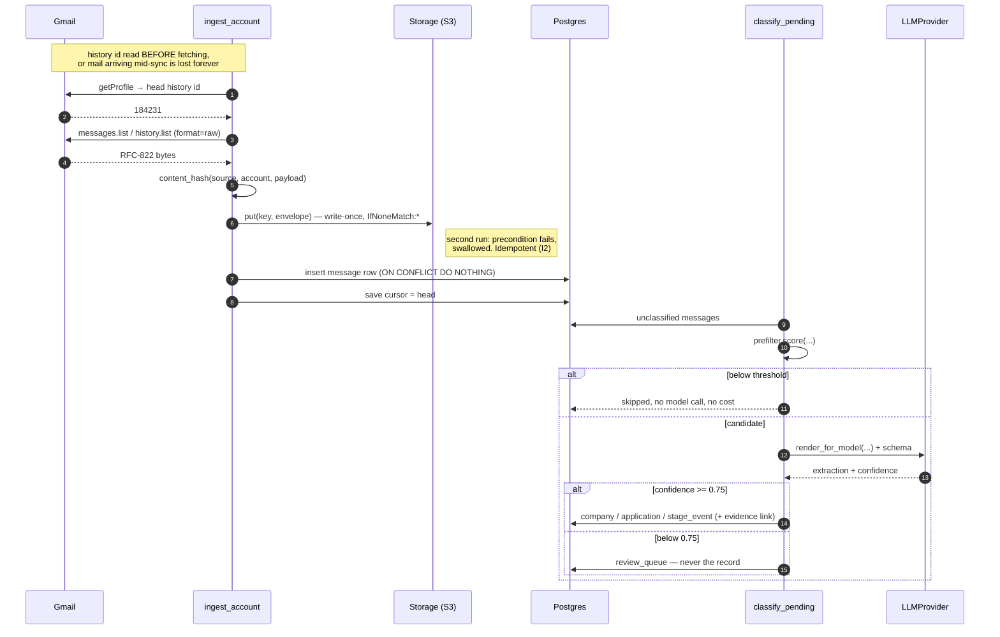
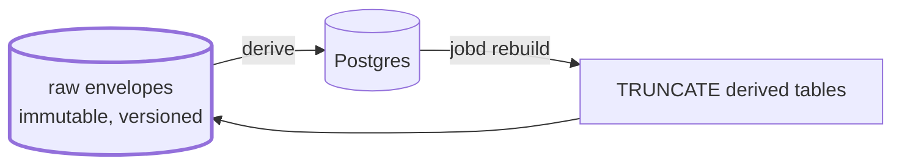

# Architecture

Hexagonal. A pure domain core, five ports, and adapters that can be swapped
without the core noticing. Below that, event sourcing: raw messages in object
storage are the source of truth, and Postgres is a derived working store that
can be thrown away and rebuilt (I3).

## The whole system

Dashed ports are declared and not yet implemented. `Sender` stays empty until
M8, and when it arrives it is reachable only behind a recorded human approval
(I1) — the planner never holds it.

## One message, end to end

## Why raw is the source of truth

Every derived table is disposable. A better prompt, a fixed resolver, a new
stage — none of them need a migration that back-fills, because the input is
still on disk and re-deriving the world is a routine command rather than an
event. The cursor table is the one exception: it records how far a *source* has
been read, which raw storage cannot tell you.

## Where the rules live

| Invariant | Enforced by |
|---|---|
| I1 · no send without recorded approval | `Sender` port unimplemented; planner holds no send-capable tool |
| I2 · idempotent ingestion | content hash + write-once `put` + `ON CONFLICT DO NOTHING` |
| I3 · rebuildable from raw | `services/rebuild.py`, tested by deriving twice and comparing |
| I4 · raw mail stays in your storage | only pre-filtered candidates reach a cloud model; corpus in CI is synthetic |
| I5 · ingested content is untrusted | extraction is schema-constrained; no tool the model can call |
